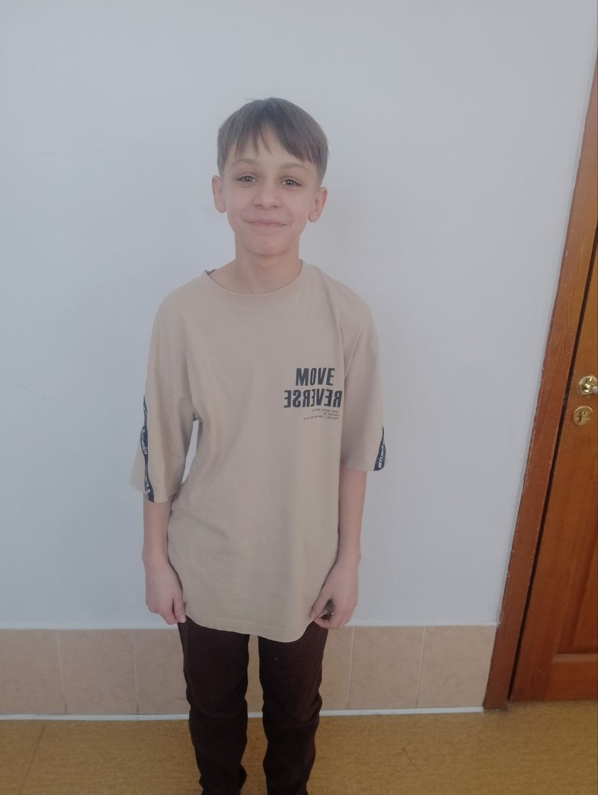

<!DOCTYPE html>
<html lang="ru">
<head>
    <meta charset="UTF-8">
    <meta name="viewport" content="width=device-width, initial-scale=1.0">
    <title>Семён Юрьевтің дәйексөздері · музыка + таңдаулылар</title>
    
    <!-- Библиотека для QR кода -->
    
</head>
<body class="theme-dark">
    <!-- ВИДЕО ФОН 1 — возьми телефон -->
    <video class="video1-bg" autoplay muted loop playsinline>
        <source src="videoplayback.mp4" type="video/mp4">
        Ваш браузер не поддерживает видеофон.
    </video>

    <!-- ВИДЕО ФОН 2 — скилзскам -->
    <video class="video2-bg" autoplay muted loop playsinline>
        <source src="2881834453749.mp4" type="video/mp4">
        Ваш браузер не поддерживает видеофон.
    </video>

    <!-- ФОТО ФОН -->
    

    <!-- QR модальное окно -->
    

        

            <h3 id="qrQuoteText">Цитата</h3>
            <canvas id="qrCanvas"></canvas>
            <button class="close-qr" id="closeQrBtn">Закрыть</button>
        

    

    

        

            <h1 id="siteTitle">Семён Юрьев</h1>
            

                

                    <button class="lang-btn" id="langRuBtn" data-lang="ru">🇷🇺 Русский</button>
                    <button class="lang-btn" id="langKzBtn" data-lang="kz">🇰🇿 Қазақша</button>
                

                

                    <button class="theme-btn" id="themeDarkBtn" data-theme="dark">🌙 тёмная</button>
                    <button class="theme-btn" id="themeLightBtn" data-theme="light">☀️ светлая</button>
                    <button class="theme-btn" id="themeAzureBtn" data-theme="azure">💜 лазурная</button>
                    <button class="theme-btn" id="themeVideo1Btn" data-theme="video1">📱 возьми телефон</button>
                    <button class="theme-btn" id="themeVideo2Btn" data-theme="video2">🎬 скилзскам</button>
                    <button class="theme-btn" id="themePhotoBtn" data-theme="photo">🖼️ фото</button>
                

            

        

        
цитаты, которые стали легендой

        <!-- МУЗЫКАЛЬНЫЙ ПЛЕЕР -->
        

            🎵 Музыка:
            <audio id="bgMusic" loop autoplay>
                <source src="tisheyurev.mp3" type="audio/mpeg">
                Ваш браузер не поддерживает аудио.
            </audio>
            <button class="music-btn" id="playPauseBtn">⏸️ Пауза</button>
            <button class="music-btn" id="stopBtn">⏹️ Стоп</button>
            <select id="musicSelect" class="music-btn" style="background: inherit;">
                <option value="tisheyurev.mp3" selected>🎵 tisheyurev.mp3</option>
                <option value="lowtabyurev.mp3">🎵 лоутаб таллин (1).mp3</option>
            </select>
        

        

            
случайная мысль

            
—

            
— Семён Юрьев

            

            <button class="btn" id="newQuoteBtn">🎲 Показать другую</button>
            <button class="btn" id="copyRandomBtn">📋 Копировать</button>
            <button class="btn" id="shareRandomBtn">📱 Поделиться</button>
            <button class="btn" id="qrRandomBtn">📱 QR код</button>
            <button class="btn" id="favRandomBtn">⭐ В избранное</button>
        

        

            

                🔍
                <input type="text" class="search-input" id="searchInput" placeholder="Поиск по цитатам..." autocomplete="off">
                <button class="search-clear" id="searchClearBtn" title="Очистить">✖ Очистить</button>
            

            
всего цитат: 12

        

        

            🗂️ Полное собрание
            
            <button class="btn" id="showFavoritesBtn">⭐ Показать избранное</button>
        

        <!-- Сортировка -->
        

            <button class="sort-btn" id="sortDateNewBtn">📅 Сначала новые</button>
            <button class="sort-btn" id="sortDateOldBtn">📅 Сначала старые</button>
        

        

        <footer>
            © 2026 — сборник высказываний (по мотивам реальных событий)
        </footer>
    

    
</body>
</html>
